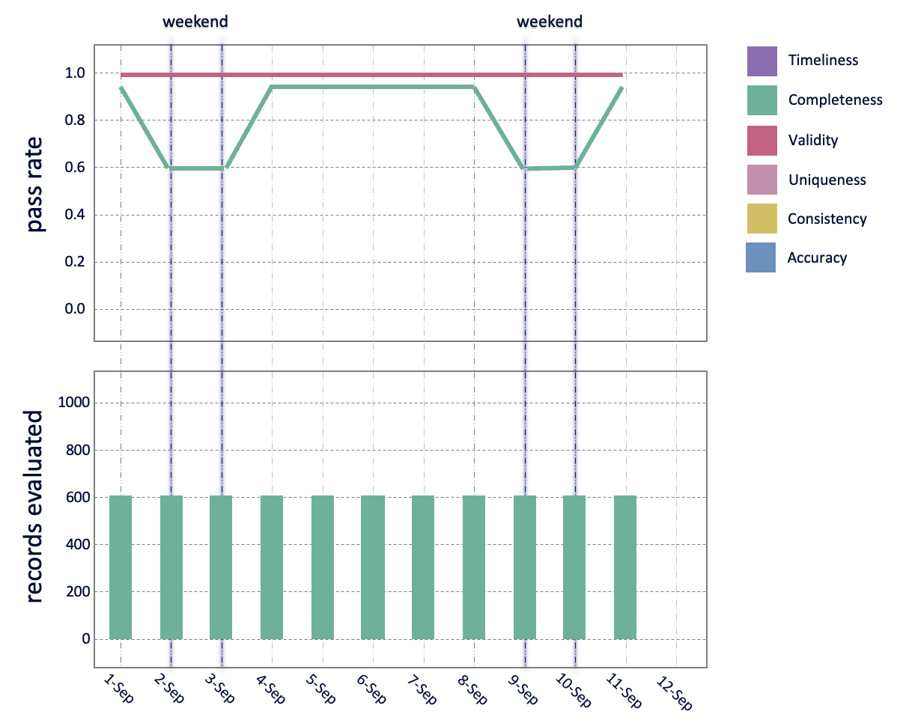
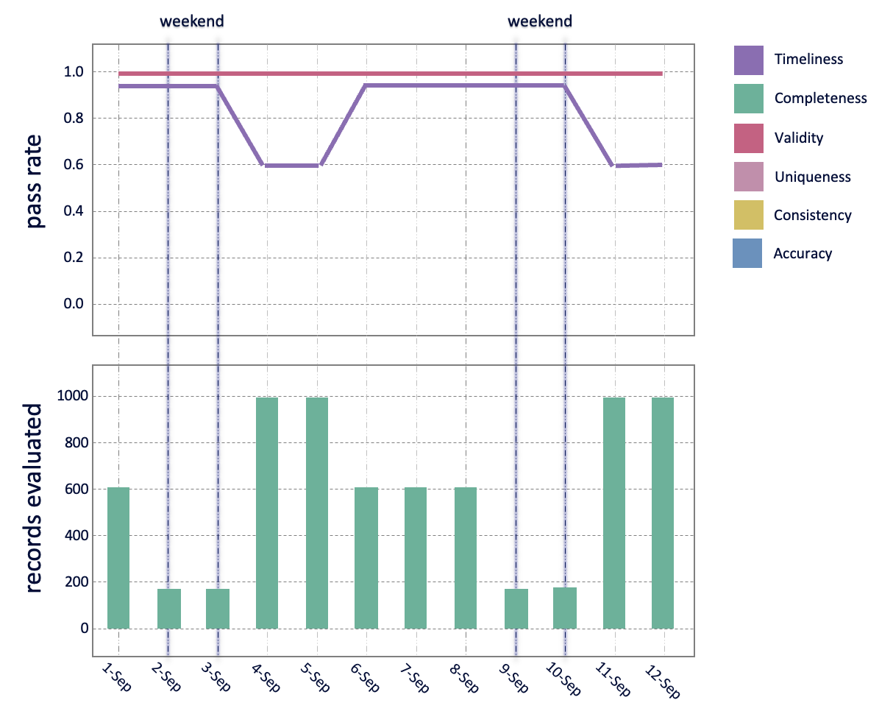
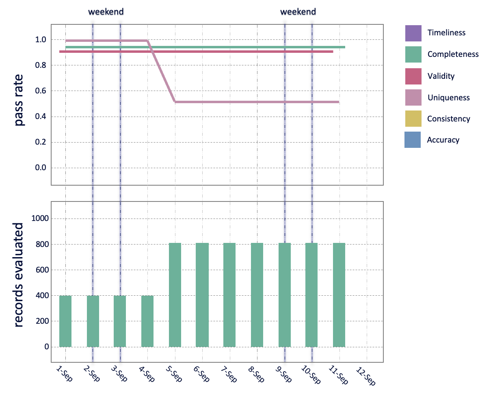

# Insights from a Data Quality dashboard
We present some patterns we have seen in our dashboards and what that meant in practice. This shows how a particular dashboard design can give useful insights as to the origin of a data quality issue.

## Dashboard advice
It is useful to plot the change in the `pass_rate` over `measurement_time`, broken down by the `data_quality_dimension`. Position this directly above a plot showing the number of `records_evaluated`, such that the values for `measurement_time` line up along the vertical.

See mock-up images linked to each insight article below.

## Pattern 1: Weekend dips

### Finding (image description)
The validity score is constant over time, but the completeness score dips at weekends. There are no changes to the number of records evaluated.

### Insight
We are getting fewer fields populated at weekends. Perhaps, at the source of this data, people fill it out less diligently at the weekend.
Our high validity score and the fact that completeness bounces back up to a high level after the weekend suggests our data extraction pipeline is working fine. This is likely a source data problem.

## Pattern 2: Weekend data arriving late

### Finding (image description)
The timeliness score is lower after weekends. Also the records evaluated for that low timeliness score are a lot higher.
There are very few records being evaluated during the weekends.

### Insight
Data for the weekend is being sent on a Monday and Tuesday (in addition to the data for Mon & Tue). This means we get an increase in records as we are measuring the backlog from the weekend. If the timeliness rule states data should be no older than 24hrs, then much of the backlog data we get will fail that rule, resulting in a low timeliness score.

## Pattern 3: Duplicate data

### Finding (image description)
The uniqueness score drops to 0.5. At the same time, the record counts double.

### Insight
We are getting sent duplicate data (quite probably an exact duplicate as a score of 0.5 means 50% of the values are duplicated, the other 50% are a copy).

A uniqueness score close to zero would been all values in a column are the same (1 value / large number of records)

If the timeliness score also drop – then it means you are being sent duplicates of old data

## Pattern 4: Pipeline failure

### Finding (image description)
Both completeness and validity pass rate plummet suddenly. We are also checking fewer records at the same time

### Insight
This is likely to be something changing in the data pipeline as we ingest the data. The upstream data could have changed, or something has changed in our pipeline. It means we are not extracting values as expected, and we are now missing some values as well.

## Pattern 5: New entries in a list

### Finding (image description)
The accuracy pass rate decreases, no other changes

### Insight
The Accuracy rule checks values against an authoritative list. If the score reduces, it means we have values that aren’t in that list. It could be we need to update our authoritative list, or there is a data entry problem and invalid values are being sent.

For example, if this was looking at capital cities, and somewhere in the world a city got a name change, or the capital moved, then we would expect the accuracy score to drop (if we didn’t update our authoritative list to match).

We would also expect this to reduce if there was a typo in one of the capital cities suddenly being sent.

